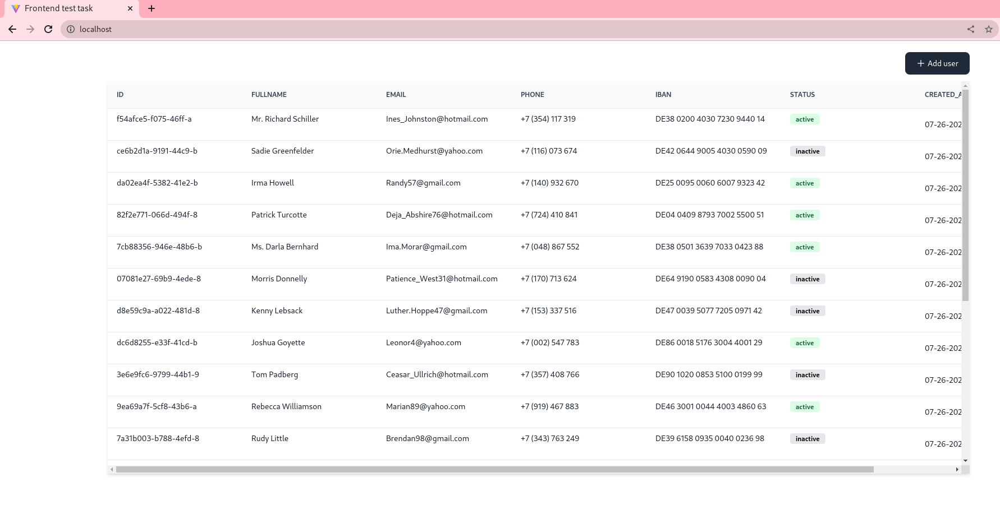

# Frontend test task

Simple table with infinite loading and editing: [preview](https://frontend-test-task-table.vercel.app/)

## Sources

The resources with the assignment can be found [at](https://docs.google.com/document/d/16IkxQ_ZDRxrfnzdjQdYP5UfyloGwmwXsZ5IEXEbuL2E/edit)

## Setup

To run this project, install it locally

- Clone repository
- Navigate to the project directory
- Install and run:

### Using yarn

```bash
yarn install
yarn dev
```

or

### Using npm

```bash
npm install
npm run dev
```

## Deploy with docker-compose

```bash
docker-compose up -d
```

## Сheck the result

List containers

```bash
$ docker ps

CONTAINER ID   IMAGE                          COMMAND                   CREATED              STATUS              PORTS                               NAMES
7e34d10fef75   frontend-test-task_test-task   "nginx -g 'daemon of…"   About a minute ago   Up About a minute   0.0.0.0:80->80/tcp, :::80->80/tcp   test-task
```

## Stop and remove containers

```bash
docker-compose down
```

## After starting the application, go to navigate <http://localhost>



## Tests

To run the tests, do the following:

```bash
yarn test
```

or

```bash
npm run test
```

## Technology Stack

1. React Effector Typescript Tailwindcss Headlessui
2. Vite Jest
3. Eslint Husky Lintstaged

## Structure

Project designed by [FeatureSliced](https://feature-sliced.design/)

- `app` - application initialization
- `pages` - application pages
- `features` - parts of the application functionality
- `shared` - reused infrastructure code

```sh
└── src/
    ├── app/
    ├── pages/
    ├── features/
    ├── shared/
    └── main.tsx/
```
